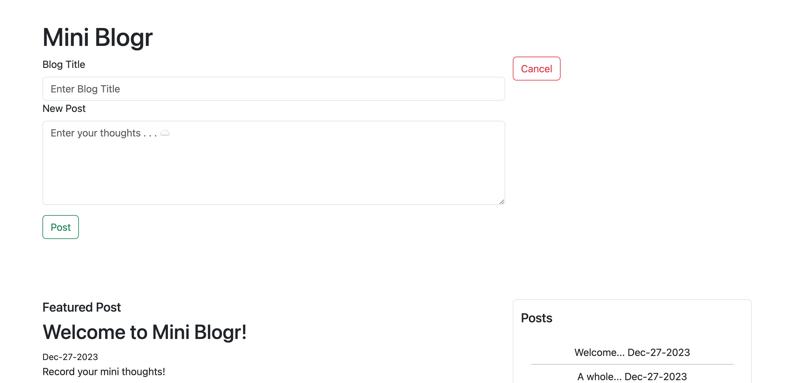

# Mini Blogr Web App

## Overview

Mini Blogr is a simple web app designed for creating and managing blog posts. It provides basic functionalities like writing, editing, and deleting blog posts.

## How to Use

To use this web app:

1. Clone this repository to your local machine.
2. Install the necessary dependencies by running `npm install`.
3. Run the server using `npm run server` to start the Mini Blogr app.
4. In your browser, navigate to `localhost:5001`

### Features

- **Write Blog Posts:** Click the "Write" button to start creating a new blog post.
- **Edit Posts:** Use the "Edit" button to modify an existing blog post.
- **Delete Posts:** Delete unwanted posts using the "Delete" button.

## File Structure

- `index.html`: Contains the HTML structure of the Mini Blogr app.
- `styles/style.css`: CSS file for styling the web app.
- `scripts/axios.js`: Axios library for handling HTTP requests.
- `scripts/client.js`: Client-side JavaScript file for handling app functionality.
- External Libraries:
  - Bootstrap: Used for styling and modal functionalities.
